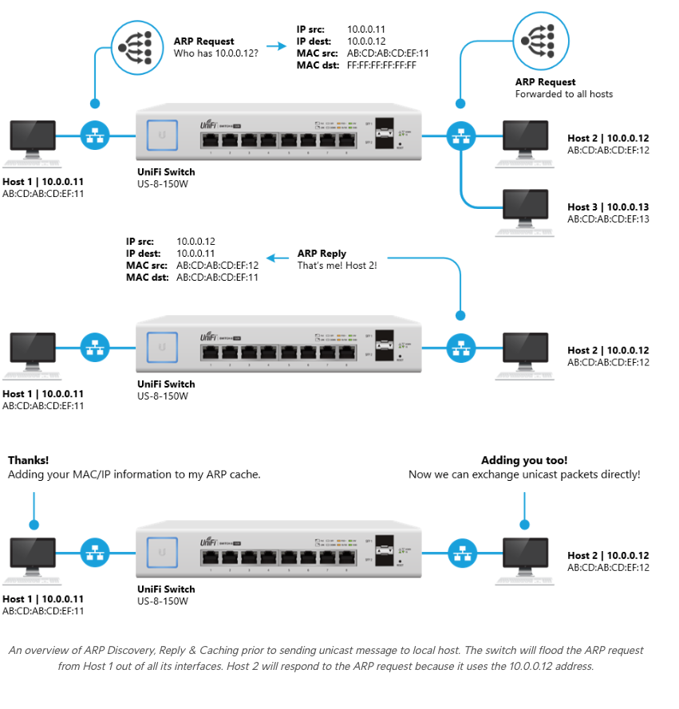
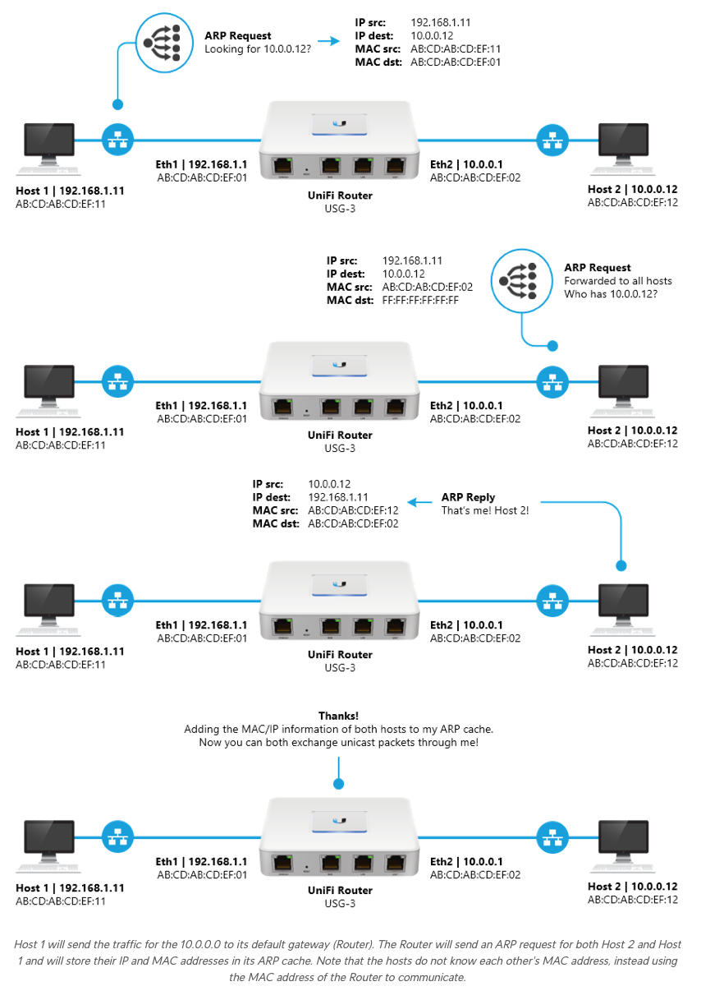

# **Understanding ARP (Address Resolution Protocol)**

### **What Is ARP?**

ARP (Address Resolution Protocol) is a fundamental Layer 2 protocol used in IPv4 networks to map **IP addresses (Layer
3)** to **MAC addresses (Layer 2)**. It enables devices within the same broadcast domain to locate the hardware address
of another device, allowing communication over a local network.

---

## **How ARP Works**

1. **ARP Request (Broadcast)**:
    - When a device needs to communicate with an IP address, it sends an ARP request:
        - The request is broadcast to all devices in the local network (`FF:FF:FF:FF:FF:FF` as the destination MAC).
        - Example: "Who has IP `192.168.1.10`? Tell me."

2. **ARP Reply (Unicast)**:
    - The device with the requested IP responds with its MAC address:
        - The reply is sent as a unicast directly to the requester.
        - Example: "192.168.1.10 is at MAC `00:1A:2B:3C:4D:5E`."

3. **ARP Cache**:
    - Both devices store the IP-to-MAC mapping in their ARP cache to avoid repeating the process for future
      communications.

---

## **Broadcast vs. Unicast**

- **Broadcast**:
    - ARP requests are sent as a broadcast to all devices in the local subnet, ensuring the intended recipient receives
      the message.
- **Unicast**:
    - ARP replies are sent directly to the requesting device using unicast.

---

## **Gratuitous ARP**

### **What Is Gratuitous ARP?**

A **Gratuitous ARP** is an unsolicited ARP message that a device sends to announce or update its IP-to-MAC mapping on
the network. Unlike traditional ARP messages, gratuitous ARPs are not triggered by a request.

### **Types of Gratuitous ARP Messages**

1. **ARP Request (Self-Announcement)**:
    - A device broadcasts: "Who has IP `192.168.1.10`? Tell `192.168.1.10`."
    - This informs all devices in the network that `192.168.1.10` is now associated with the sender's MAC address.

2. **ARP Reply (Reaffirmation)**:
    - A device sends an unsolicited ARP reply: "192.168.1.10 is at MAC `00:1A:2B:3C:4D:5E`."
    - Updates devices on the network without requiring a prior request.

### **Uses of Gratuitous ARP**

- **IP Conflict Detection**:
    - A device sends a gratuitous ARP to check if another device on the network is using the same IP address.
- **Failover and VIP Updates**:
    - Used by systems like MetalLB and Kube-VIP to reassign virtual IPs during failover, ensuring the network updates
      its ARP cache with the new MAC address.
- **ARP Cache Update**:
    - Forces devices to refresh their ARP cache, especially useful in dynamic environments.

---

## **ARP Spoofing**

### **What Is ARP Spoofing?**

ARP spoofing is a type of **man-in-the-middle (MITM) attack** where a malicious device sends fake ARP replies to mislead
other devices on the network. By poisoning the ARP cache of target devices, the attacker can intercept, modify, or block
network traffic.

### **How ARP Spoofing Works**

1. The attacker sends forged ARP replies to devices, associating their MAC address with a legitimate IP address (e.g.,
   the default gateway).
2. Victims update their ARP cache with the malicious MAC address, redirecting their traffic to the attacker.

### **Impact of ARP Spoofing**

- **Eavesdropping**: The attacker can monitor sensitive data like login credentials.
- **Traffic Manipulation**: The attacker can alter or drop traffic, causing disruption.
- **Network Downtime**: Spoofing can destabilise communication between devices.

### **Mitigation Strategies**

- **Static ARP Entries**: Manually configure critical IP-to-MAC mappings.
- **Dynamic ARP Inspection (DAI)**: Enable security features on managed switches to detect and block spoofed ARP
  packets.
- **Encryption**: Use HTTPS or VPNs to protect sensitive traffic.

---

## **Summary**

ARP is a simple yet essential protocol for local network communication, enabling devices to discover MAC addresses for
IP addresses. While gratuitous ARP enhances functionality for failover and IP conflict resolution, it also highlights
ARP’s inherent trust model, which makes it vulnerable to attacks like ARP spoofing. Proper security practices, including
ARP inspection and encryption, can mitigate these risks.

---

## **Further Reading**

- [ARP on Layer 2 and Layer-3 Networks](https://help.ui.com/hc/en-us/articles/115005984408-Intro-to-Networking-Address-Resolution-Protocol-ARP)

