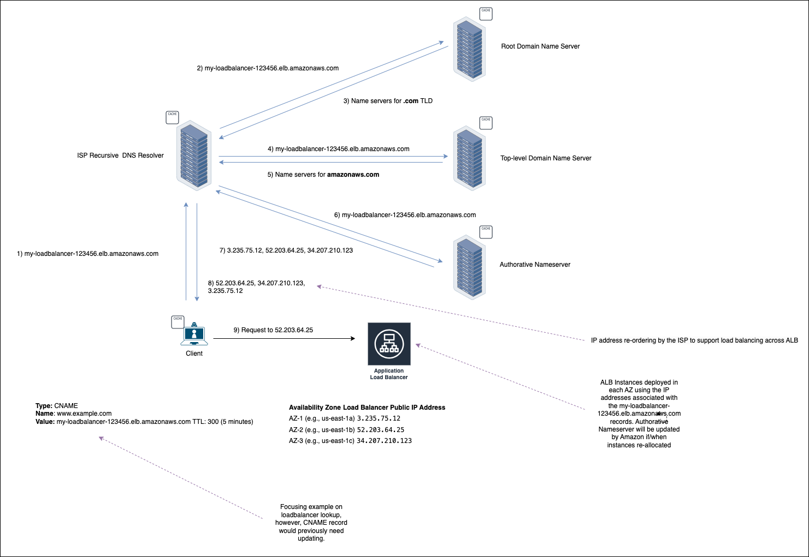

# **Technical Research Summary: DNS Overview and Cloud Load Balancer Integration**

## **1. Introduction to DNS**

The **Domain Name System (DNS)** is the backbone of the internet, translating human-readable domain names (e.g.,
`www.example.com`) into machine-readable IP addresses (e.g., `192.168.1.1`). This hierarchical, distributed system
ensures seamless communication between clients and servers.

---

## **2. DNS Resolution Process**

### **Hierarchical Structure**

1. **Root Level:**
    - The top of the DNS hierarchy, directing queries to the appropriate **Top-Level Domain (TLD)** servers.
    - Examples: `.com`, `.org`, `.uk`.

2. **TLD Nameservers:**
    - Handle requests for specific domains under their TLD and direct queries to the authoritative nameservers.

3. **Authoritative Nameservers:**
    - Contain the definitive DNS records (e.g., `A`, `CNAME`, `MX`) for a domain and return them to the requester.

### **Steps in DNS Resolution**

1. **Client Query:** A client queries its configured recursive resolver (e.g., ISP or public DNS).
2. **Recursive Resolver:** Navigates the DNS hierarchy to resolve the query:
    - Queries the root server to locate the TLD nameserver.
    - Queries the TLD nameserver to locate the authoritative nameserver.
    - Queries the authoritative nameserver for the desired DNS record.
3. **Response:** The resolver returns the resolved IP address to the client, which then connects to the server.

---

## **3. DNS Caching**

### **Where Caching Occurs**

1. **Client-Side:**
    - Devices cache DNS responses locally to avoid repeated queries.
    - Examples: Operating systems (e.g., Windows, Linux), browsers.

2. **Recursive Resolvers:**
    - ISPs and public DNS services cache responses for the duration of the **Time-to-Live (TTL)** specified in the DNS
      record.

3. **Intermediate Devices:**
    - Routers, proxies, and CDNs may cache DNS responses to improve performance.

### **Time-to-Live (TTL):**

- The TTL value determines how long a DNS record can be cached before requiring a fresh query.
- Typical TTL values:
    - Dynamic environments: 60 seconds.
    - Stable environments: 24 hours or more.

---

## **4. Interaction with Cloud Load Balancers**

### **DNS and Load Balancers**

Cloud load balancers (e.g., AWS Application Load Balancers) rely on DNS to expose services to the internet. These load
balancers are typically assigned a **DNS name** (e.g., `my-loadbalancer-123456.elb.amazonaws.com`) that resolves to one
or more IP addresses.

### **Key Features:**

1. **Dynamic vs Static IPs:**
    - ALBs and CLBs use dynamic IPs.
    - NLBs support static IPs or Elastic IPs.

2. **Redundancy and High Availability:**
    - Load balancers operate across multiple availability zones.
    - DNS names resolve to multiple IPs for fault tolerance.

### **Client Handling of Multiple IPs**

When DNS returns multiple IPs:

- Clients typically attempt the **first IP** in the list and retry with others on failure.
- Modern clients may open parallel connections to multiple IPs, selecting the fastest response.

---

## **5. DNS Query Scenarios**

### **Scenario 1: Cold Start (Record Not Cached)**

1. Recursive resolver queries root, TLD, and authoritative nameservers to resolve the domain.
2. The response is cached for future use.

### **Scenario 2: Cached Record (TTL Valid)**

1. Resolver serves the cached response directly to the client.
2. No upstream queries are needed.

### **Scenario 3: Cache Expired (TTL Exceeded)**

1. Resolver performs a new query to refresh the cache.
2. Updated IP addresses are returned if changes occurred.

---

## **6. Role of Authoritative Nameservers**

### **Responsibilities:**

- Provide the definitive DNS records for a domain.
- Return records such as `A` (IP address), `CNAME` (alias), `MX` (mail), and `NS` (nameservers).

### **Caching of Nameserver Details:**

- Recursive resolvers cache **NS records** and associated glue records for the TTL specified.

### **Redundancy and Rotation:**

- Nameservers often have multiple IPs for redundancy and use technologies like **anycast** to distribute queries
  globally.

---

## **7. Recursive Resolver Behaviour**

### **Randomising or Rotating IPs:**

- If an authoritative nameserver returns multiple IPs, the recursive resolver may:
    - Rotate the order (round-robin) for load balancing.
    - Return the list as-is, leaving clients to decide the order of access.

### **Caching Strategy:**

- Resolvers cache the IP addresses based on TTL to optimise performance and reduce upstream query load.

---

## **8. Best Practices**

### **For DNS Configuration:**

1. Use short TTLs for dynamic environments to ensure rapid propagation of changes.
2. Configure longer TTLs for stable environments to reduce query load.
3. Enable DNSSEC to protect against tampering and spoofing.

### **For Cloud Load Balancers:**

1. Always use the DNS name of the load balancer, not hard-coded IPs.
2. Monitor DNS records to ensure they align with the load balancer’s configuration.
3. Use multiple IPs or anycast for high availability and performance.

---

## **9. Summary**

- DNS is a hierarchical, distributed system that translates domain names into IP addresses.
- Recursive resolvers navigate the DNS hierarchy and cache responses to optimise performance.
- Cloud load balancers depend on DNS for service exposure, leveraging dynamic or static IPs.
- Proper TTL management, caching, and redundancy ensure DNS and load balancer reliability.

This document provides a foundational understanding of DNS and its integration with cloud load balancers, highlighting
the importance of caching, fault tolerance, and best practices for reliable service delivery.

