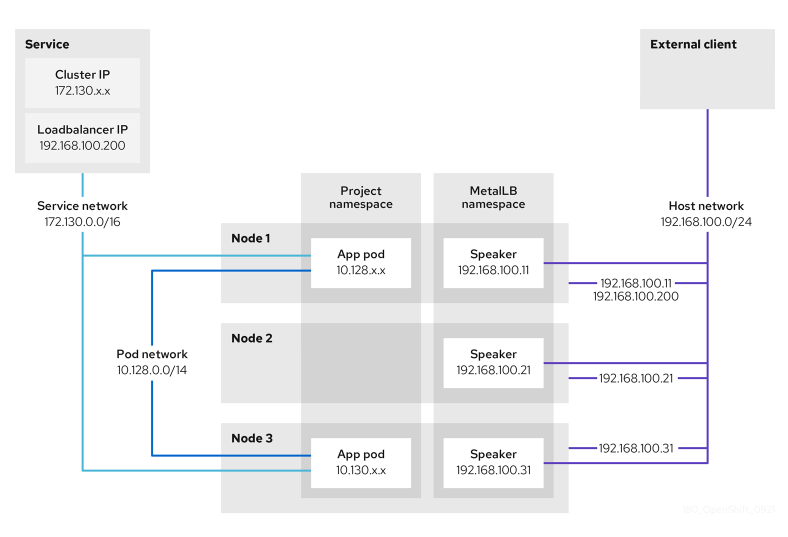

# **Deep Dive into MetalLB and Load Balancer Behaviour in Kubernetes**

## **Introduction**

MetalLB brings `LoadBalancer` functionality to bare-metal Kubernetes clusters, providing a cloud-like experience for
exposing services externally. This guide explores **MetalLB in Layer 2 mode**, focusing on how it handles failover, ARP
mechanics, traffic distribution, and common deployment patterns, including ingress controllers.

---

## **1. MetalLB Overview**

### **What Is MetalLB?**

MetalLB is a **Kubernetes-native load balancer** designed for bare-metal environments. Unlike cloud providers (e.g., AWS
ELB or GCP Load Balancer), bare-metal setups lack native `LoadBalancer` support, which is where MetalLB comes in.

### **How Does MetalLB Work?**

MetalLB operates in two modes:

1. **Layer 2 (ARP/NDP)**:
    - Advertises `LoadBalancer` IPs on the local Layer 2 network using **ARP (IPv4)** or **NDP (IPv6)**.
    - Traffic destined for the IP is routed to a single Kubernetes node.

2. **BGP Mode**:
    - Uses the **Border Gateway Protocol** to advertise `LoadBalancer` IPs to upstream routers.
    - Allows multiple nodes to advertise the same IP, enabling true multi-node load balancing.

### **When to Use Layer 2 Mode**

Layer 2 mode is simpler to configure and works well in home or small business networks where BGP is not available.
However, it introduces limitations like single-node bottlenecks.

---

## **2. Layer 2 Mode: IP Assignment and ARP**

### **ARP Basics**

ARP resolves **IP addresses (Layer 3)** to **MAC addresses (Layer 2)** within a local network.

#### **How ARP Works**

1. **Request**: A client sends a broadcast ARP request:

```
Who has 192.168.1.240? Tell 192.168.1.100
```

2. **Reply**: The node advertising the `LoadBalancer` IP responds:

```
192.168.1.240 is at 00:1A:2B:3C:4D:5E
```

### **Gratuitous ARP**

Gratuitous ARP is a special type of ARP message used to proactively update devices in the network. It is **unsolicited
**, meaning it is not in response to an ARP request.

#### **Why Gratuitous ARP Matters in MetalLB**

- During failover, MetalLB uses gratuitous ARP to announce that the `LoadBalancer` IP is now associated with a new
  node's MAC address.
- This updates the ARP tables of all devices on the network, ensuring traffic flows to the new node.

#### **Example Gratuitous ARP Packet**

If the `LoadBalancer` IP `192.168.1.240` moves to a node with MAC `00:4F:6E:7A:8C:9D`, the new node sends:

```
192.168.1.240 is at 00:4F:6E:7A:8C:9D
```

---

## **3. Failover Mechanics in Layer 2 Mode**

### **What Happens During Node Failure?**

1. **Node Detection**:
    - Kubernetes detects that the node advertising the `LoadBalancer` IP is unhealthy.
2. **MetalLB Reassignment**:
    - MetalLB reassigns the IP to another healthy node.
3. **Gratuitous ARP**:
    - The new node sends a gratuitous ARP to inform the network of the updated IP-to-MAC mapping.

### **Traffic Impact**

- Devices that process the gratuitous ARP update their ARP tables immediately, causing minimal traffic disruption (
  milliseconds to a few seconds).
- If gratuitous ARP fails or is delayed, devices will rely on their ARP cache expiry (typically 20 minutes on macOS),
  resulting in traffic loss.

---

## **4. Traffic Distribution and Bottlenecks**

In Layer 2 mode, the `LoadBalancer` IP is tied to a single node at any time. This creates potential bottlenecks:

- All traffic destined for the IP flows through the single node, even if backend pods are distributed across multiple
  nodes.
- High traffic volumes can overload the node's CPU, memory, or network interface.

---

## **5. Solutions to Single-Node Bottlenecks**

### **1. Use MetalLB in BGP Mode**

- Allows multiple nodes to advertise the same `LoadBalancer` IP.
- Upstream routers distribute traffic across nodes, reducing the risk of bottlenecks.

### **2. Deploy an Ingress Controller**

- Use an ingress controller like Traefik or NGINX with multiple replicas.
- Expose the ingress controller via a single `LoadBalancer` service.
- Kubernetes’ service routing spreads traffic across the ingress replicas.

### **3. ExternalTrafficPolicy: Local**

- Configuring `externalTrafficPolicy: Local` ensures that traffic is only sent to pods running on the node receiving the
  request.
- Reduces inter-node traffic but requires backend pods to be distributed across nodes.

---

## **6. Example Configuration**

### **MetalLB ConfigMap (Layer 2 Mode)**

```yaml
apiVersion: v1
kind: ConfigMap
metadata:
  namespace: metallb-system
  name: config
data:
  config: |
    address-pools:
    - name: default
      protocol: layer2
      addresses:
      - 192.168.1.240-192.168.1.250
```

** Traefik Ingress Controller Deployment

```yaml
apiVersion: apps/v1
kind: Deployment
metadata:
  name: traefik
spec:
  replicas: 3
  selector:
    matchLabels:
      app: traefik
  template:
    metadata:
      labels:
        app: traefik
    spec:
      containers:
        - name: traefik
          image: traefik:v2.9
---
apiVersion: v1
kind: Service
metadata:
  name: traefik
spec:
  type: LoadBalancer
  selector:
    app: traefik
  ports:
    - port: 80
      targetPort: 80
    - port: 443
      targetPort: 443
```

## **7. Deep-Dive**

### **MetalLB Speaker**

The **MetalLB Speaker** is a component of MetalLB deployed as a **DaemonSet**, ensuring a speaker pod runs on every
Kubernetes node. Its primary role is to advertise `LoadBalancer` IPs to the network, enabling external traffic to reach
the cluster.

#### **Responsibilities of the Speaker**

1. **IP Advertisement**:
    - In **Layer 2 mode**, the speaker uses ARP (IPv4) or NDP (IPv6) to announce the assigned IP on the local Layer 2
      network.
    - In **BGP mode**, the speaker communicates with upstream routers using the Border Gateway Protocol.

2. **Failover Handling**:
    - If the node currently advertising a `LoadBalancer` IP fails, the speaker on another node takes over and begins
      advertising the IP.

3. **Traffic Routing**:
    - Ensures that external traffic for the `LoadBalancer` IP is directed to the correct Kubernetes service.

### **Leader Election in MetalLB**

MetalLB **does not use traditional leader election for its speaker pods**. Instead:

- In **Layer 2 mode**, a single speaker pod advertises the `LoadBalancer` IP at any given time. MetalLB uses a
  deterministic algorithm to decide which node advertises the IP. This selection is typically based on the node's status
  and readiness.
- In **BGP mode**, multiple speaker pods can advertise the same `LoadBalancer` IP simultaneously, enabling load
  balancing and redundancy through Equal-Cost Multi-Path (ECMP) routing.

### **How MetalLB Handles Node Failures**

1. MetalLB continuously monitors the health of nodes and services.
2. If the current node advertising the IP becomes unhealthy, MetalLB reassigns the IP to another healthy node.
3. The new speaker pod broadcasts the updated IP-to-MAC mapping (Layer 2) or BGP advertisement.

## **8. Worked Example**



### **Summary of MetalLB Concepts**

#### **1. Service and IP Addresses**

- The application is exposed through a Kubernetes service with:
    - A **Cluster IP** (e.g., `172.130.0.0/16`) for internal cluster access.
    - An **External IP** (e.g., `192.168.100.200`) assigned by MetalLB for external access.

#### **2. Application Deployment**

- The application runs on pods located on:
    - **Node 1**
    - **Node 3**

#### **3. MetalLB Speaker Pods**

- MetalLB deploys a **speaker daemon set** that runs a pod on each node.
- Each speaker pod operates in **host network mode**, meaning its IP address matches the node's network IP.

#### **4. ARP Announcements**

- The speaker pod on **Node 1** announces the external IP (`192.168.100.200`) via **ARP**.
- The speaker pod responsible for announcing the external IP must:
    - Be on the same node as a **service endpoint** for the application.
    - Ensure the service endpoint is in a **Ready** condition.

#### **5. Traffic Routing**

- Clients connect to the external IP (`192.168.100.200`) via the host network.
- Once traffic enters the node:
    - If **ExternalTrafficPolicy** is set to `Cluster`, the service proxy can route traffic to any application pod,
      whether local or remote.
    - If **ExternalTrafficPolicy** is set to `Local`, traffic is routed only to local pods on the node advertising the
      external IP.

#### **6. Failover Mechanism**

- If **Node 1** becomes unavailable:
    - MetalLB fails over the external IP (`192.168.100.200`) to another eligible node.
    - In this example:
        - **Node 3** becomes the new announcer since it hosts:
            - A speaker pod.
            - A **Ready** application pod.
        - The speaker pod on **Node 3** announces the external IP, and all client traffic is redirected to Node 3.

## **9. Key Takeaways**

### **Failover with Minimal Disruption**

- MetalLB uses **gratuitous ARP** to update the network during failover, keeping the IP constant while changing the MAC
  address.

### **Traffic Distribution**

- In **Layer 2 mode**, traffic flows through a single node, potentially causing bottlenecks.

### **Mitigation Strategies**

1. Use **BGP mode** for true multi-node load balancing.
2. Deploy an **ingress controller** with multiple replicas to distribute load within Kubernetes.

---

## **Further Reading**

- [MetalLB Documentation](https://metallb.universe.tf/)
- [Practical Networking: Gratuitous ARP](https://www.practicalnetworking.net/series/arp/gratuitous-arp/)
- [Kubernetes Services](https://kubernetes.io/docs/concepts/services-networking/service/)


